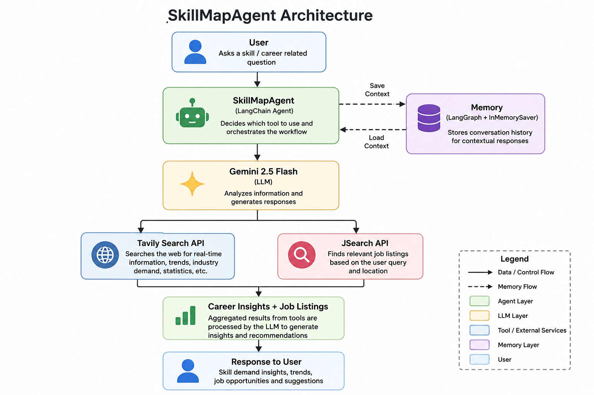

# SkillMapAgent

An AI-powered career guidance assistant that helps users analyze industry demand for skills and discover relevant job opportunities using Generative AI, real-time web search, and job search APIs.

---

## Overview

SkillMapAgent is a multi-tool AI agent built using LangChain, LangGraph, Gemini, Tavily Search, and JSearch APIs.

The agent helps students and professionals:

* Understand industry demand for specific skills
* Explore career trends and opportunities
* Discover relevant job openings
* Ask follow-up questions using conversational memory

---

## Features

* Skill Demand Analysis
* Industry Trend Research
* Real-Time Job Search
* Conversational Memory
* Career Guidance Recommendations
* Multi-Tool AI Agent Architecture
* Context-Aware Follow-Up Queries

---

## Architecture



---

## How It Works

1. User enters a skill or career-related query.
2. The LangChain Agent receives the request.
3. Gemini 2.5 Flash analyzes the query.
4. Tavily Search gathers industry trends and demand insights.
5. JSearch API retrieves relevant job opportunities.
6. LangGraph Memory stores conversation history.
7. The AI agent combines all information and generates a response.

---

## Tech Stack

### AI & Agent Frameworks

* LangChain
* LangGraph
* Gemini 2.5 Flash

### APIs

* Tavily Search API
* JSearch API (RapidAPI)

### Programming Language

* Python

### Development Environment

* Google Colab

---

## Project Structure

```text
skillmap-agent/
│
├── README.md
├── requirements.txt
├── .gitignore
├── architecture.png
├── skillmap_agent.ipynb
```

---

## Installation

Clone the repository:

```bash
git clone https://github.com/anvitha-45/skillmap-agent.git
cd skillmap-agent
```

Install dependencies:

```bash
pip install -r requirements.txt
```

---

## Required API Keys

Create and configure the following API keys:

* GOOGLE_API_KEY
* TAVILY_API_KEY
* RAPIDAPI_KEY

In Google Colab:

```python
from google.colab import userdata

GOOGLE_API_KEY = userdata.get("GOOGLE_API_KEY")
TAVILY_API_KEY = userdata.get("TAVILY_API_KEY")
RAPIDAPI_KEY = userdata.get("RAPIDAPI_KEY")
```

---

## Example Query

```text
What's the demand for Generative AI in the industry and show me related job openings in India?
```

### Example Follow-Up Query

```text
Tell me more about the second job you showed.
```

---

## Key Concepts Demonstrated

* Generative AI
* AI Agents
* Tool Calling
* Conversational Memory
* API Integration
* Prompt Engineering
* Retrieval-Augmented Search
* Career Intelligence Systems

---

## Future Enhancements

* Streamlit Web Application
* Resume Analyzer
* Skill Gap Detection
* Learning Roadmap Generator
* Interview Preparation Assistant
* Personalized Career Recommendations
* Job Bookmarking System

---

## Learning Outcomes

Through this project, I gained hands-on experience with:

* Building AI Agents using LangChain
* Managing memory with LangGraph
* Integrating external APIs
* Working with Gemini models
* Designing tool-calling workflows
* Developing real-world Generative AI applications

---

## Author

**P. Deepanvitha Sri Sai**

B.Tech Computer Science Engineering

Sri Vasavi Engineering College

GitHub: https://github.com/anvitha-45

---

## License

This project is developed for learning and educational purposes.
